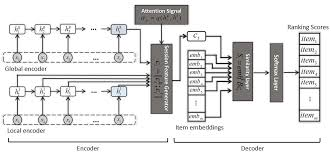

# Neural-Attentive-Session-Based-Recommendation-PyTorch
A PyTorch implementation of the NARM model in [Neural Attentive Session Based Recommendation](https://arxiv.org/abs/1711.04725) (Li, Jing, et al. "Neural attentive session-based recommendation." Proceedings of the 2017 ACM on Conference on Information and Knowledge Management. ACM, 2017).



# Usage
1. Install required packages from requirements.txt file.
```bash
pip install -r requirements.txt
```

2. Download datasets used in the paper: [YOOCHOOSE](http://2015.recsyschallenge.com/challenge.html) and [DIGINETICA](http://cikm2016.cs.iupui.edu/cikm-cup). Put the two specific files named `train-item-views.csv` and `yoochoose-clicks.dat` into the folder `datasets/`

3. Change to `datasets` fold and run `preprocess.py` script to preprocess datasets. Two directories named after dataset should be generated under `datasets/`.
```bash
python preprocess.py --dataset diginetica
python preprocess.py --dataset yoochoose
```

4. Run main.py file to train the model. You can configure some training parameters through the command line. 
```bash
python main.py
```

5. Run main.py file to test the model.
```bash
python main.py --test
```